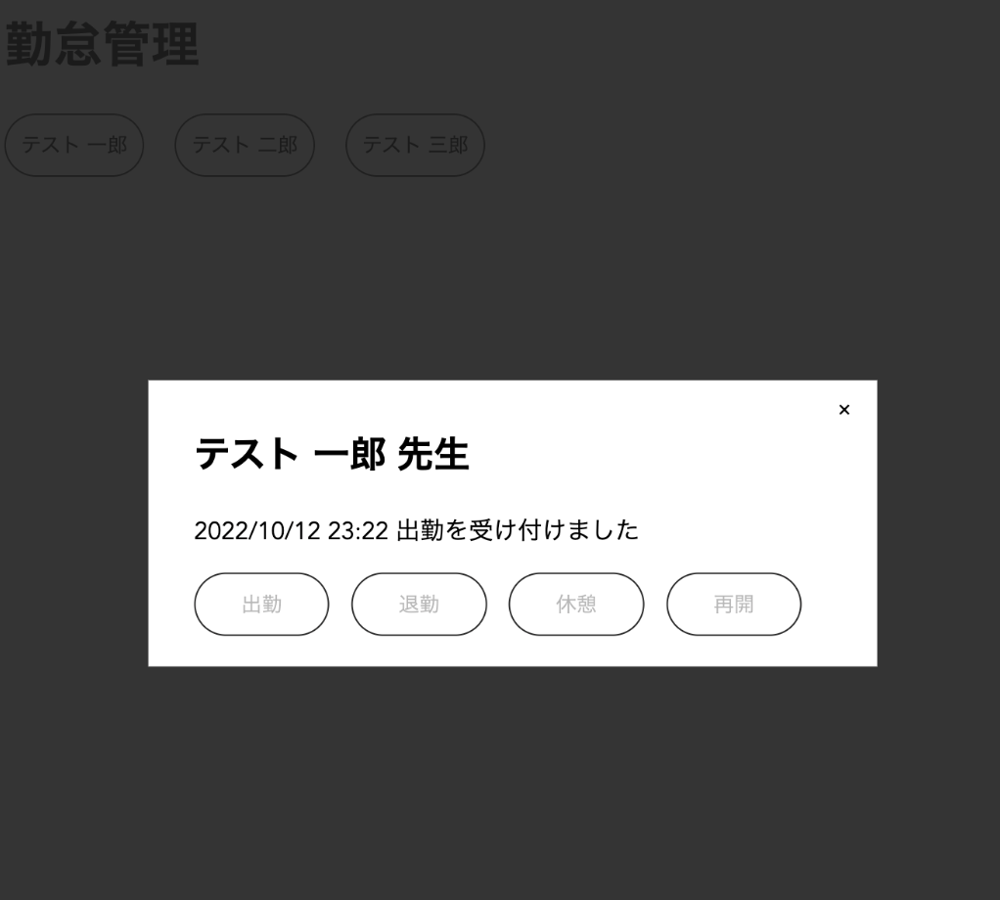
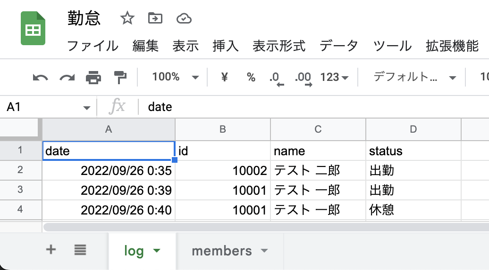
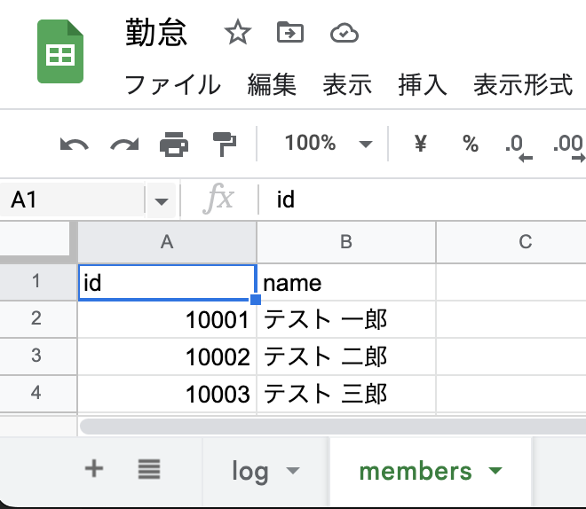

# gas-attendance-system
Attendance logger using Google Apps Script

## 概要
Google Apps Scriptで勤怠の打刻ができるウェブアプリケーションです。Googleスプレッドシートを用意して使用します。

## 使用方法
### 新規Googleスプレッドシートの作成
1. 以下のような新規Googleスプレッドシートを作成します。
   - logシートには、date, id, name, statusの見出し項目のみ用意します。ウェブアプリケーションで打刻するとレコードが記載されます。
   
   - membersシートには、id, nameの見出し項目とデータを用意します。
   

1. スプレッドシートのメニューから、拡張機能 > Apps Scriptをクリックします。

### Apps Scriptの作成
1. Apps Script上で「ファイルを追加」し、4つのファイルを準備します。このリポジトリのファイルから中身をコピーします。
   - コード.gs (= code.gs)
   - index.html
   - JavaScript.html
   - Stylesheet.html

1. コード.gsにある`SPREAD_SHEET_ID`の値を作成したGoogleスプレッドシートのIDに変更します。（IDはURLに含まれています。`https://docs.google.com/spreadsheets/d/[スプレッドシートのID]/edit`）

1. 変更を保存します。
1. ウェブアプリとして「デプロイ」します。

### 動作確認
Apps Scriptのデプロイ時に表示されるURLにアクセスして、動作確認します。

## 参考サイト
参考にさせていただきました。ありがとうございます。
- https://tonari-it.com/gas-web-doget-html-output/
- https://qiita.com/Yami_37/items/b4ed2bd2e20ffe7dfbca
- https://myscreate.com/pure-modal/